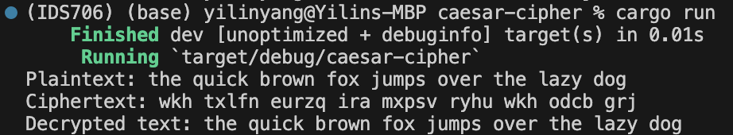
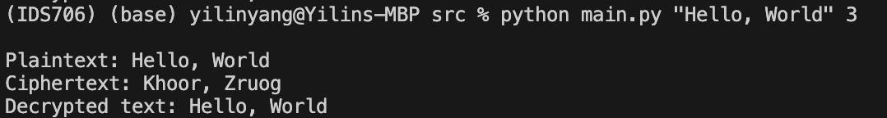
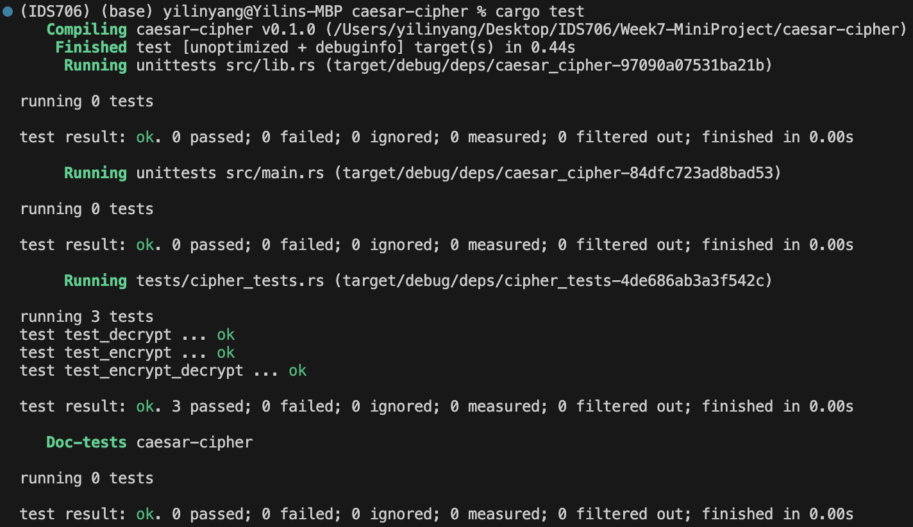

[](https://github.com/nogibjj/rust-data-engineering/actions/workflows/lint.yml)
[](https://github.com/nogibjj/rust-data-engineering/actions/workflows/tests.yml)


# User Guide for Caesar Cipher CLI Tool

## Project Description

This project is a command-line interface (CLI) tool written in Rust, providing functionalities to encrypt and decrypt messages using the Caesar cipher method.

## File Structure

```
/Project
|-- src
|   |-- lib.rs
|   |-- main.rs
|
|-- tests
|   |-- cipher_tests.rs
|
|-- Cargo.toml
```

## Run the CLI Tool in Rust

```bash
cargo build
cargo run
```


## Run the CLI Tool in Python

```bash
python main.py <message> <shift>
```


## Performance Comparison

Here is the result:

|Language|      Run Script 1 Time       |       Run Script 1000 Times        | Average Resource Usage                                                                                     |
|:---:|:--------------------------------:|:-----------------------------------:|:-----------------------------------------------------------------------------------------------------------|
|Python| Total time elapsed: 0.042 seconds |  Total time elapsed: 24.5 seconds  | User time: 0.02 seconds <br> System time: 0.01 seconds <br> CPU usage: 69% <br> Total time: 0.058 seconds  |
|Rust| Total time elapsed: 0.42 seconds  | Total time elapsed: 14.0 seconds | User time: 0.03 seconds<br> System time: 0.01 seconds <br> CPU usage: 9% <br> Total time: 0.461 seconds    |
## Test
```bash
cargo test
```


## Makefile

Each subdirectory project uses this style to make it easy to test and run

```
format:
	cargo fmt --quiet

lint:
	cargo clippy --quiet

test:
	cargo test --quiet

run:
	cargo run 

all: format lint test run
```


## References

* [Rust Collections](https://doc.rust-lang.org/std/collections/index.html)
* [GitHub Copilot CLI](https://www.npmjs.com/package/@githubnext/github-copilot-cli)
* [Rust Fundamentals](https://github.com/alfredodeza/rust-fundamentals)
* [Rust Tutorial](https://nogibjj.github.io/rust-tutorial/)
* [Rust MLOps Template](https://github.com/nogibjj/mlops-template)
